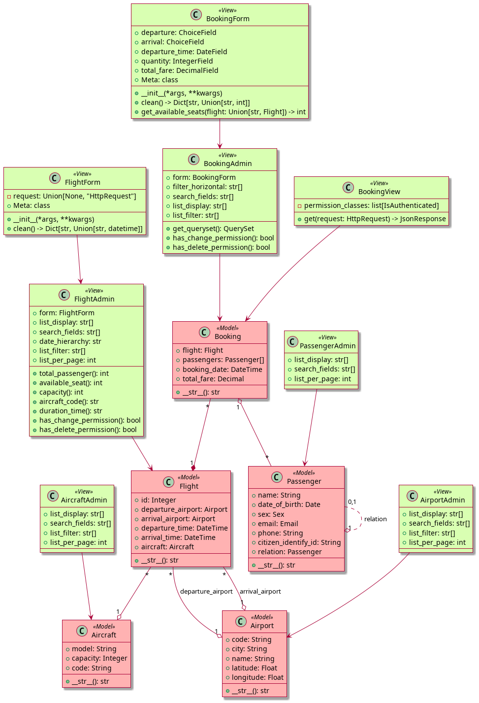

# Aviation management

## Class diagram


## Quick Start

Ensure you have Python, pipenv, Docker, and docker-compose installed.

```bash
# Install pipenv if not installed
pip install pipenv

# Set up virtual environment
pipenv shell

# Install dependencies
pipenv install

# Start Docker containers
docker compose up

# Create .env file
cp .env.sample .env

# Run setup script for migration and data import
python scripts/setup.sh

# Start the server
python manage.py runserver
```

## Users

We have 3 predefined users:

- **Super Admin**
  - **Username:** admin
  - **Password:** 123456

- **Ticketing Staff**
  - **Username:** ticketingstaff
  - **Password:** ticketingstaff

- **Flight Manager**
  - **Username:** flightmanager
  - **Password:** flightmanager

## Testing
Run test cases using the following command:
```
./manage.py test
```
To run a specific test case:
```
python ./manage.py test aviation.tests.test_models
```
## Test Results
After running tests, you'll see coverage report:
```
$ coverage run --source='.' manage.py test
...
$ coverage report
```

```
Name                                  Stmts   Miss  Cover
---------------------------------------------------------
aviation/__init__.py                      0      0   100%
aviation/admin.py                       111     15    86%
aviation/apps.py                          4      0   100%
aviation/forms.py                        94     16    83%
aviation/migrations/0001_initial.py       8      0   100%
aviation/migrations/__init__.py           0      0   100%
aviation/models.py                       51      2    96%
aviation/tests/__init__.py                0      0   100%
aviation/tests/test_admins.py           126      0   100%
aviation/tests/test_forms.py             72      0   100%
aviation/tests/test_models.py           169      0   100%
aviation/tests/test_views.py             32      0   100%
aviation/urls.py                          3      0   100%
aviation/utils.py                        31      1    97%
aviation/views.py                        32      1    97%
config/__init__.py                        0      0   100%
config/settings.py                       28      0   100%
config/urls.py                            9      0   100%
manage.py                                12      2    83%
---------------------------------------------------------
TOTAL                                   782     37    95%
```

